<div align="center">

# 🛍️ Retail360 — End-to-End GCP Data Engineering Platform

### A production-style, metadata-driven retail data platform built on Google Cloud

**GCS → Cloud Run Jobs → BigQuery → dbt → Apache Airflow → Analytics**

[](https://cloud.google.com/)
[](https://www.python.org/)
[](https://cloud.google.com/bigquery)
[](https://www.getdbt.com/)
[](https://airflow.apache.org/)
[](https://www.terraform.io/)

</div>

---

## 📌 Project Overview

**Retail360** is an end-to-end cloud data engineering project designed to demonstrate how a modern retail data platform can be built, deployed, and orchestrated on Google Cloud Platform.

The platform ingests retail flat files from Google Cloud Storage, validates and processes each file through containerized Python workloads running as Cloud Run Jobs, loads validated data into BigQuery, transforms raw data into analytics-ready dimensional models using dbt, and orchestrates the complete workflow using Apache Airflow.

The project follows production-oriented engineering practices such as metadata-driven ingestion, file-level validation, duplicate detection, rejected-file isolation, audit logging, incremental processing, SCD Type 2 history, Infrastructure as Code, and CI/CD.

---

## 🏗️ Solution Architecture

<p align="center">
  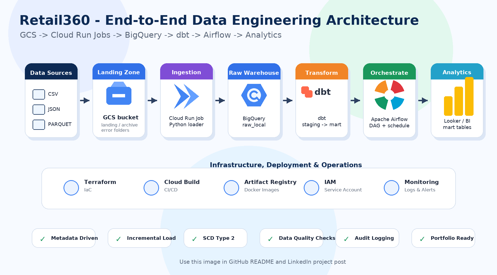
</p>

### High-Level Data Flow

```text
Retail Source Files
        │
        ▼
Google Cloud Storage
(raw / archive / duplicate / rejected)
        │
        ▼
Cloud Run Ingestion Job
(Python validation, extraction and loading)
        │
        ▼
BigQuery Raw Layer
        │
        ▼
dbt Transformation Layer
(staging → intermediate → snapshots → marts)
        │
        ▼
Analytics-Ready Dimensions, Facts and Customer 360 Mart

Apache Airflow orchestrates ingestion and dbt Cloud Run Jobs.
Cloud Build and Artifact Registry provide CI/CD and image management.
Terraform provisions the cloud infrastructure.
```

---

## ✨ Key Engineering Features

- **Metadata-driven ingestion** using YAML configuration
- **Modular Python design** for extraction, validation, loading, auditing, logging, and storage operations
- **File-level schema and data-type validation**
- **Duplicate-file detection** using an audit table
- **Fault-tolerant processing** so one invalid file does not fail the entire pipeline
- **GCS file lifecycle management** using `raw`, `archive`, `duplicate`, and `rejected` folders
- **Containerized batch processing** through Google Cloud Run Jobs
- **Layered BigQuery warehouse** with raw, staging, base, and mart datasets
- **dbt staging, intermediate, snapshot, dimension, fact, and mart models**
- **SCD Type 2 history tracking** using dbt snapshots
- **Parallel ingestion orchestration** using Apache Airflow TaskGroup
- **Separate ingestion and dbt Docker images** stored in Artifact Registry
- **Automated CI/CD** using GitHub-connected Cloud Build triggers
- **Infrastructure as Code** using Terraform
- **Centralized logging and auditability** for operational monitoring

---

## 🧰 Technology Stack

| Layer | Technology | Purpose |
|---|---|---|
| Programming | Python, SQL | Ingestion, validation and transformation logic |
| Object Storage | Google Cloud Storage | Landing, archive, duplicate and rejected file zones |
| Compute | Cloud Run Jobs | Serverless execution of ingestion and dbt workloads |
| Data Warehouse | BigQuery | Raw and analytics-ready datasets |
| Transformation | dbt Core | Modular SQL transformations, tests and snapshots |
| Orchestration | Apache Airflow | Dependency management and end-to-end scheduling |
| Containers | Docker | Reproducible runtime environments |
| Image Registry | Artifact Registry | Storage and versioning of Docker images |
| CI/CD | Cloud Build | Automated image build and Cloud Run deployment |
| Infrastructure | Terraform | Repeatable cloud resource provisioning |
| Version Control | GitHub | Source control and CI/CD integration |

---

## 📂 Repository Structure

```text
retailer360-data-engineer-project/
├── airflow/                     # Airflow project and DAG definitions
│   └── dags/
│       └── retailer360_pipeline.py
├── dbt/                         # dbt transformation project
│   ├── models/
│   │   ├── staging/
│   │   ├── intermediate/
│   │   └── marts/
│   ├── snapshots/
│   ├── macros/
│   ├── seeds/
│   ├── Dockerfile.dbt
│   ├── profiles.yml
│   └── requirements-dbt.txt
├── src/                         # Python ingestion application
│   ├── audit.py
│   ├── bq_load.py
│   ├── config.yml
│   ├── extractor.py
│   ├── logger.py
│   ├── main.py
│   ├── schema.py
│   ├── storage_utils.py
│   └── validate_schema.py
├── terraform/                   # Infrastructure as Code
│   ├── bigquery.tf
│   ├── bucket.tf
│   ├── main.tf
│   ├── variables.tf
│   └── outputs.tf
├── docs/
│   └── screenshots/             # README visual evidence
├── cloudbuild.yaml              # Ingestion image CI/CD
├── Dockerfile                   # Ingestion container image
├── requirements.txt
└── README.md
```

<details>
<summary><b>📷 View project structure</b></summary>
<br>
<p align="center">
  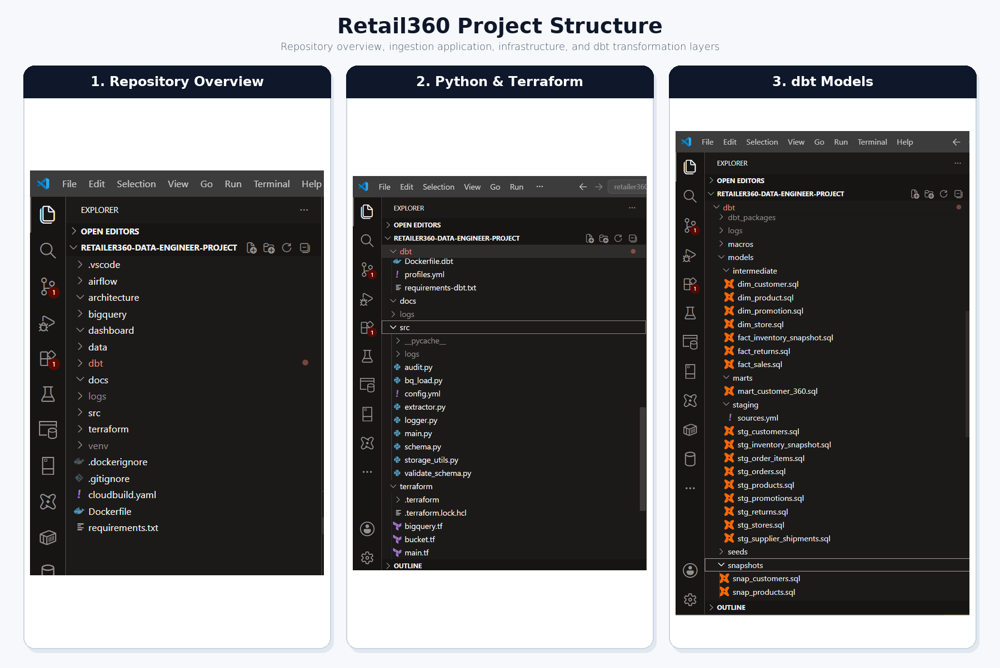
</p>
</details>

---

## 🔄 Pipeline Workflow

1. Retail CSV, JSON, or other configured source files arrive in the GCS raw zone.
2. Apache Airflow starts parallel ingestion tasks inside a TaskGroup.
3. Each Airflow task executes the Cloud Run ingestion job for a configured source.
4. The Python application validates file name, schema, data types, and processing history.
5. Valid data is loaded into the appropriate BigQuery raw table.
6. Successfully processed files move to `archive/`.
7. Previously processed files move to `duplicate/`.
8. Invalid files move to `rejected/` without stopping other ingestion tasks.
9. After all ingestion tasks succeed, Airflow executes the dbt Cloud Run Job.
10. dbt builds staging, intermediate, snapshot, dimension, fact, and mart models.
11. BigQuery mart tables become ready for analytics and reporting.

---

## 🖼️ Project Walkthrough

### 1. Apache Airflow Orchestration

The DAG executes multiple ingestion tasks in parallel through a TaskGroup. After ingestion completes, the DAG triggers the dedicated dbt Cloud Run Job.

<p align="center">
  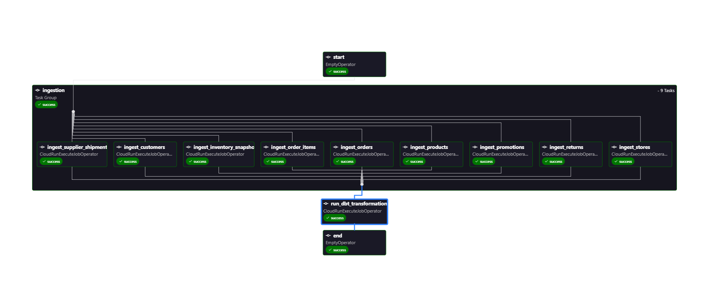
</p>

**Demonstrated capabilities:** parallelism, task grouping, dependency management, Cloud Run integration, dbt orchestration, and successful execution tracking.

---

### 2. dbt Transformation and Lineage

The dbt project converts raw BigQuery tables into reusable staging models, snapshots, dimensions, facts, and the Customer 360 business mart.

<p align="center">
  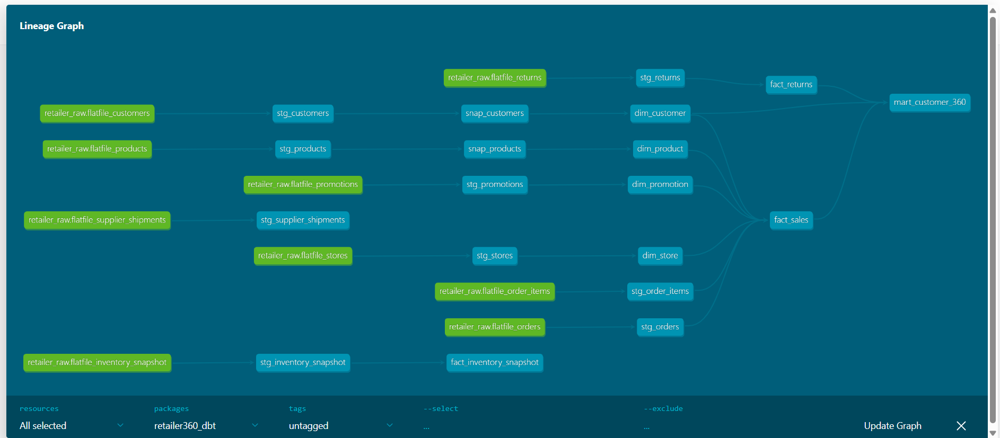
</p>

<details>
<summary><b>📷 View dbt model folder structure</b></summary>
<br>
<p align="center">
  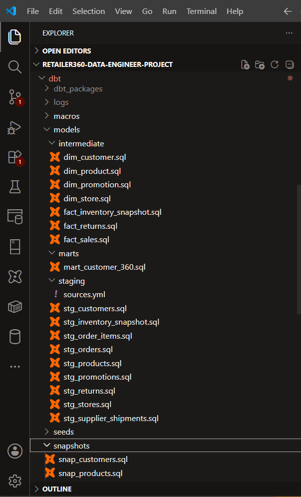
</p>
</details>

---

### 3. Google Cloud Storage File Lifecycle

The storage design separates incoming, successful, duplicate, and invalid files to support traceability and fault-tolerant processing.

<p align="center">
  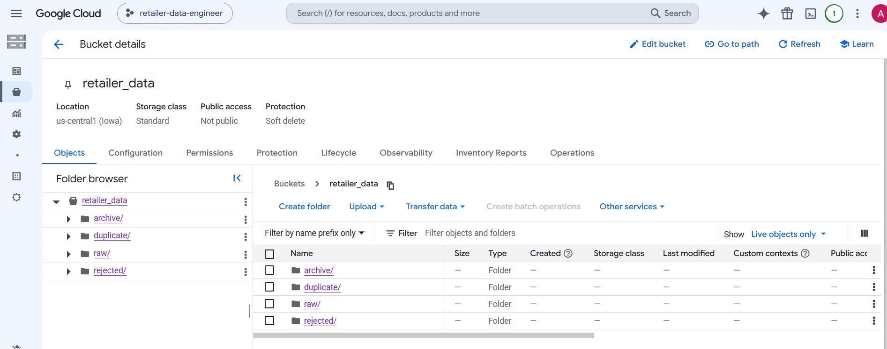
</p>

```text
retailer_data/
├── raw/         # Incoming files awaiting processing
├── archive/     # Successfully processed files
├── duplicate/   # Files already recorded in the audit table
└── rejected/    # Files failing validation or processing
```

---

### 4. BigQuery Data Warehouse

BigQuery datasets separate raw ingestion data from transformed and analytics-ready models.

<p align="center">
  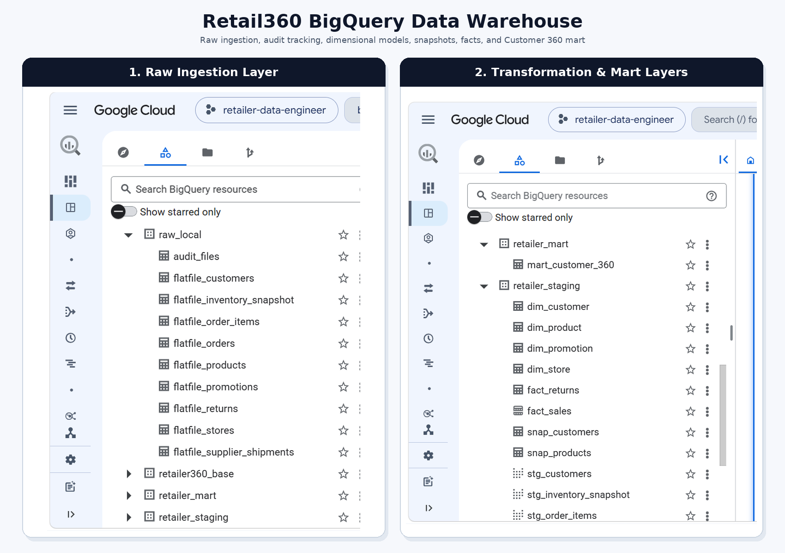
</p>

- `raw_local` — raw source-aligned tables and file audit records
- `retailer_staging` — cleaned and standardized transformation models
- `retailer360_base` — reusable business-level models and snapshots
- `retailer_mart` — analytics-ready dimensions, facts, and marts

---

### 5. Cloud Run Jobs

Independent Cloud Run Jobs are used for ingestion and dbt execution, allowing separate deployment, scaling, permissions, and failure handling.

<p align="center">
  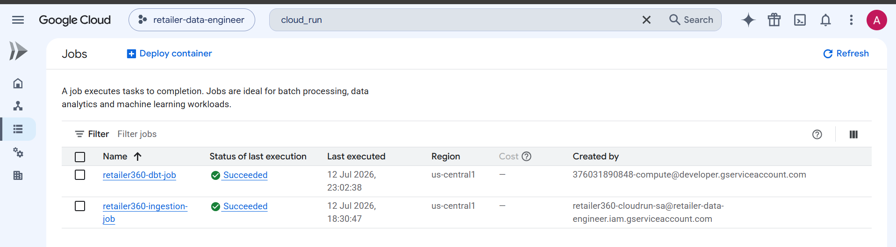
</p>

---

### 6. CI/CD with Cloud Build

GitHub-connected triggers automatically build and deploy the ingestion and dbt workloads when relevant code changes are pushed.

<p align="center">
  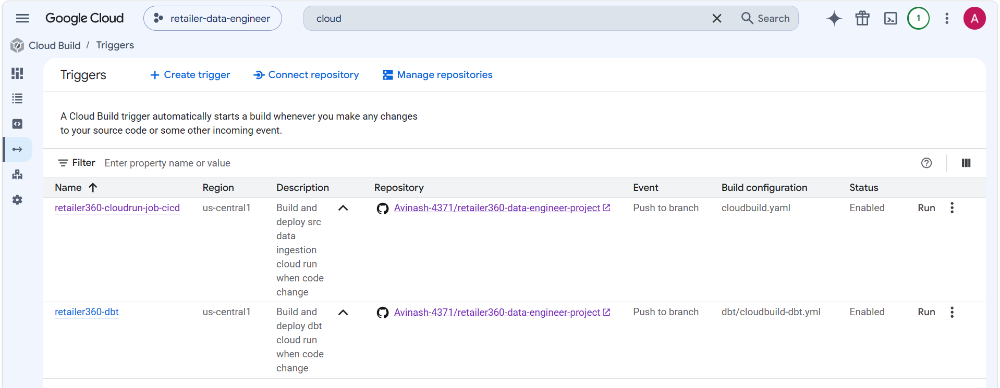
</p>

```text
GitHub Push
    ↓
Cloud Build Trigger
    ↓
Build Docker Image
    ↓
Push Image to Artifact Registry
    ↓
Deploy or Update Cloud Run Job
```

---

### 7. Artifact Registry

The Docker repository stores separate container images for the ingestion application and dbt transformation workload.

<p align="center">
  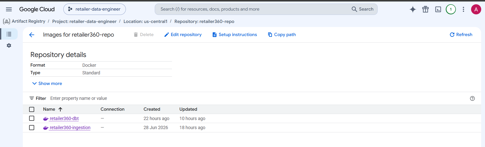
</p>

- `retailer360-ingestion`
- `retailer360-dbt`

---

### 8. Infrastructure as Code with Terraform

Terraform manages core cloud resources, including GCS buckets and BigQuery datasets, using version-controlled infrastructure definitions.

<p align="center">
  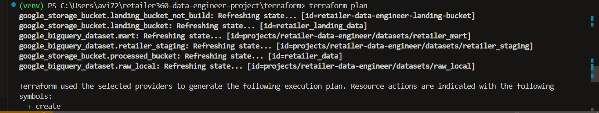
</p>

---

## 🗃️ Data Model

### Dimension Models

- `dim_customer`
- `dim_product`
- `dim_promotion`
- `dim_store`

### Fact Models

- `fact_sales`
- `fact_returns`
- `fact_inventory_snapshot`

### Business Mart

- `mart_customer_360`

### Historical Tracking

- Customer and product history is maintained through dbt snapshots using SCD Type 2 behavior.

---

## 🛡️ Data Quality and Error Handling

The pipeline is designed to continue safely when an individual file fails.

```text
Incoming File
     │
     ├── Already processed? ── Yes ──► duplicate/
     │
     ├── Schema or type failure? ─────► rejected/
     │
     ├── Load failure? ───────────────► rejected/ + error log
     │
     └── Successful load ─────────────► archive/ + audit success
```

Operational controls include:

- Explicit schema validation
- File-level status tracking
- Duplicate prevention
- Audit-table entries
- Structured logging
- Rejected-file isolation
- Independent processing across source files

---

## 🚀 CI/CD Strategy

The project uses separate build and deployment pipelines for ingestion and transformation workloads.

### Ingestion Pipeline

```text
Changes in Python ingestion code
→ Cloud Build
→ Build ingestion Docker image
→ Push to Artifact Registry
→ Update ingestion Cloud Run Job
```

### dbt Pipeline

```text
Changes in dbt project
→ Cloud Build
→ Build dbt Docker image
→ Push to Artifact Registry
→ Update dbt Cloud Run Job
```

This separation reduces coupling and allows each workload to be deployed independently.

---

## ▶️ Local Development

### Run Python ingestion locally

```bash
python -m venv venv
```

```bash
# Windows PowerShell
.\venv\Scripts\Activate.ps1
```

```bash
pip install -r requirements.txt
python src/main.py
```

### Validate the dbt project

```bash
cd dbt
dbt debug --profiles-dir .
dbt build --profiles-dir .
```

### Start local Airflow with Astro CLI

```bash
cd airflow
astro dev start
```

Open the local Airflow UI and trigger the Retail360 DAG after the services are healthy.

---

## ☁️ Cloud Execution

### Execute the ingestion job

```bash
gcloud run jobs execute retailer360-ingestion-job \
  --region us-central1 \
  --wait
```

### Execute the dbt job

```bash
gcloud run jobs execute retailer360-dbt-job \
  --region us-central1 \
  --wait
```

### Preview Terraform changes

```bash
cd terraform
terraform init
terraform validate
terraform plan
```

> Resource names, project IDs, regions, service accounts, and environment variables should be configured for the target GCP environment before execution.

---

## 🔐 Security Practices

- Dedicated service accounts for workload execution
- IAM-based access to GCS, BigQuery, Cloud Run, and Artifact Registry
- No credentials committed to source control
- Runtime configuration supplied through environment variables
- Private GCS buckets with uniform access control
- Workload permissions designed around least-privilege access

---

## Future Enhancements

- Add a **PySpark and Dataproc Serverless processing layer** to support large-scale workloads
- Add **Cloud Monitoring dashboards and alerting policies**
- Add **automated integration tests** to the CI/CD workflow
- Build **Looker Studio or Power BI dashboards** on top of the analytics mart
- Extend **Terraform coverage** to Cloud Run Jobs, IAM, Artifact Registry, and Cloud Build triggers

---

## 🎯 What This Project Demonstrates

This project demonstrates practical experience in:

- Designing an end-to-end cloud data platform
- Building modular and config-driven Python ingestion pipelines
- Implementing robust validation, auditing, and error handling
- Modeling warehouse data using dbt and dimensional concepts
- Orchestrating distributed cloud workloads with Airflow
- Containerizing and deploying batch jobs to Cloud Run
- Building CI/CD pipelines with Cloud Build and Artifact Registry
- Managing cloud infrastructure through Terraform

---

## 👤 Author

**Avinash Kumar**  
Data Engineer | GCP | BigQuery | Python | SQL | dbt | Airflow | Terraform

> If this project is useful, consider giving the repository a ⭐.
